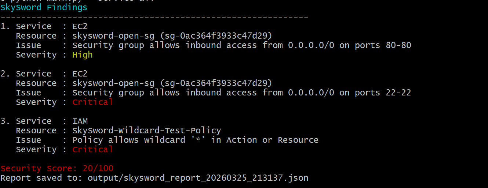

# SkySword

SkySword is a Python-based cloud security tool designed to identify AWS misconfigurations, classify findings by severity, and generate a simple security score.

## Sample Output



SkySword scanning AWS resources for S3, EC2, and IAM risks with severity-based output and JSON reporting.

## Current Features
- Scans AWS S3 buckets
- Detects potential public bucket exposure through ACLs
- Classifies findings as High or Medium
- Generates a security score out of 100
- Scans AWS EC2 security groups
- Detects public inbound exposure to 0.0.0.0/0
- Flags SSH (22) and RDP (3389) exposure as Critical
- Exports scan findings to a timestamped JSON report
- Scans IAM policies for overly permissive access
- Detects wildcard (*) permissions and admin-level policies
- Colorized terminal output by severity level

## Planned Features
- IAM misconfiguration checks
- EC2 security group exposure checks
- Critical / High / Medium risk mapping
- Exportable findings report
- Dashboard integration

## Tech Stack
- Python
- Boto3
- AWS
- Colorama

## Usage
Generated reports are saved in the `output/` directory.

```bash
pip install -r requirements.txt
python main.py

### Run all checks
```bash
python main.py --service all
```

### Run only S3 checks
```bash
python main.py --service s3
```

### Run only EC2 checks
```bash
python main.py --service ec2
```

### Run only IAM checks
```bash
python main.py --service iam
```